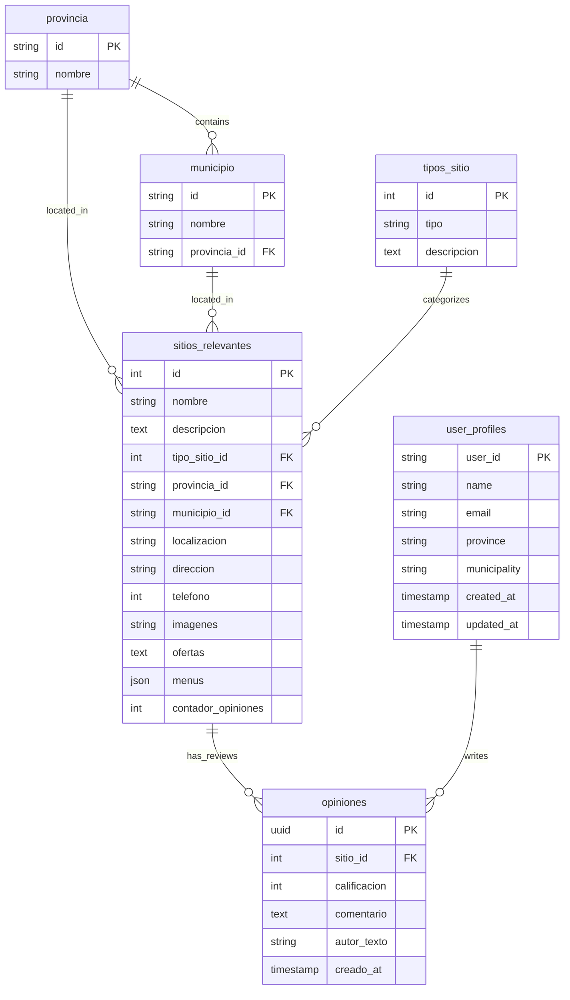

## Overview

Por el Barrio uses Supabase PostgreSQL for all data storage. The database schema is designed to support location-based business discovery with user-generated reviews.

## Database Schema

### Core Tables



## Table Definitions

### provincia (Provinces)

Geographic provinces:

```sql
CREATE TABLE provincia (
  id VARCHAR(10) PRIMARY KEY,
  nombre VARCHAR(100) NOT NULL
);

INSERT INTO provincia VALUES
  ('1', 'La Habana'),
  ('2', 'Artemisa'),
  ('3', 'Mayabeque'),
  -- ... other provinces
```

**Fields:**
- `id`: Province code
- `nombre`: Province name

### municipio (Municipalities)

Municipalities within provinces:

```sql
CREATE TABLE municipio (
  id VARCHAR(10) PRIMARY KEY,
  nombre VARCHAR(100) NOT NULL,
  provincia_id VARCHAR(10) REFERENCES provincia(id)
);

INSERT INTO municipio VALUES
  ('101', 'Plaza de la Revolución', '1'),
  ('102', 'Centro Habana', '1'),
  ('103', 'Habana Vieja', '1'),
  -- ... other municipalities
```

**Fields:**
- `id`: Municipality code
- `nombre`: Municipality name
- `provincia_id`: Foreign key to province

### tipos_sitio (Place Categories)

Business/place categories:

```sql
CREATE TABLE tipos_sitio (
  id INT PRIMARY KEY AUTO_INCREMENT,
  tipo VARCHAR(100) NOT NULL,
  descripcion TEXT
);

INSERT INTO tipos_sitio (tipo, descripcion) VALUES
  ('Restaurant', 'Restaurantes y servicios de comida'),
  ('Shop', 'Tiendas y comercios'),
  ('Service', 'Servicios profesionales');
```

**Fields:**
- `id`: Auto-increment primary key
- `tipo`: Category name
- `descripcion`: Optional description

### sitios_relevantes (Places/Businesses)

Main table for business listings:

```sql
CREATE TABLE sitios_relevantes (
  id INT PRIMARY KEY AUTO_INCREMENT,
  nombre VARCHAR(255) NOT NULL,
  localizacion VARCHAR(100) NOT NULL,
  descripcion TEXT,
  imagenes TEXT,
  ofertas TEXT,
  menus JSON,
  tipo_sitio_id INT REFERENCES tipos_sitio(id),
  direccion VARCHAR(255),
  telefono BIGINT,
  contador_opiniones INT DEFAULT 0,
  provincia_id VARCHAR(10) REFERENCES provincia(id),
  municipio_id VARCHAR(10) REFERENCES municipio(id),
  created_at TIMESTAMP DEFAULT NOW(),
  updated_at TIMESTAMP DEFAULT NOW()
);
```

**Fields:**
- `id`: Auto-increment primary key
- `nombre`: Business name
- `localizacion`: GPS coordinates ("lat,lng")
- `descripcion`: Business description
- `imagenes`: Comma-separated image URLs
- `ofertas`: Current offers/promotions
- `menus`: Menu data (JSON)
- `tipo_sitio_id`: Category foreign key
- `direccion`: Physical address
- `telefono`: Phone number
- `contador_opiniones`: Review count (computed)
- `provincia_id`: Province foreign key
- `municipio_id`: Municipality foreign key

### opiniones (Reviews)

Customer reviews for places:

```sql
CREATE TABLE opiniones (
  id UUID PRIMARY KEY DEFAULT uuid_generate_v4(),
  sitio_id INT NOT NULL REFERENCES sitios_relevantes(id) ON DELETE CASCADE,
  calificacion INT NOT NULL CHECK (calificacion >= 1 AND calificacion <= 5),
  comentario TEXT,
  autor_texto VARCHAR(255),
  creado_at TIMESTAMP DEFAULT NOW()
);

CREATE INDEX idx_opiniones_sitio ON opiniones(sitio_id);
```

**Fields:**
- `id`: UUID primary key
- `sitio_id`: Foreign key to place
- `calificacion`: Star rating (1-5)
- `comentario`: Review text (optional)
- `autor_texto`: Author name from profile
- `creado_at`: Creation timestamp

**Indexes:**
- `idx_opiniones_sitio`: Fast lookups by place

### user_profiles (User Profiles)

User preferences and profile data:

```sql
CREATE TABLE user_profiles (
  user_id VARCHAR(255) PRIMARY KEY,
  name VARCHAR(255),
  email VARCHAR(255),
  province VARCHAR(100),
  municipality VARCHAR(100),
  created_at TIMESTAMP DEFAULT NOW(),
  updated_at TIMESTAMP DEFAULT NOW()
);
```

**Fields:**
- `user_id`: OAuth openId or guest ID
- `name`: Display name
- `email`: Contact email
- `province`: Selected province (text)
- `municipality`: Selected municipality (text)

## Relationships

### Foreign Keys

```sql
-- municipio -> provincia
ALTER TABLE municipio
  ADD CONSTRAINT fk_municipio_provincia
  FOREIGN KEY (provincia_id) REFERENCES provincia(id);

-- sitios_relevantes -> tipos_sitio
ALTER TABLE sitios_relevantes
  ADD CONSTRAINT fk_sitio_tipo
  FOREIGN KEY (tipo_sitio_id) REFERENCES tipos_sitio(id);

-- sitios_relevantes -> provincia
ALTER TABLE sitios_relevantes
  ADD CONSTRAINT fk_sitio_provincia
  FOREIGN KEY (provincia_id) REFERENCES provincia(id);

-- sitios_relevantes -> municipio
ALTER TABLE sitios_relevantes
  ADD CONSTRAINT fk_sitio_municipio
  FOREIGN KEY (municipio_id) REFERENCES municipio(id);

-- opiniones -> sitios_relevantes
ALTER TABLE opiniones
  ADD CONSTRAINT fk_opinion_sitio
  FOREIGN KEY (sitio_id) REFERENCES sitios_relevantes(id)
  ON DELETE CASCADE;
```

### Cascading Deletes

- When a place is deleted, all its reviews are deleted (CASCADE)
- Other foreign keys are RESTRICT (prevent deletion if referenced)

## Indexes

### Performance Optimization

```sql
-- Fast lookups by location
CREATE INDEX idx_sitios_provincia ON sitios_relevantes(provincia_id);
CREATE INDEX idx_sitios_municipio ON sitios_relevantes(municipio_id);

-- Fast lookups by category
CREATE INDEX idx_sitios_tipo ON sitios_relevantes(tipo_sitio_id);

-- Fast review lookups
CREATE INDEX idx_opiniones_sitio ON opiniones(sitio_id);
CREATE INDEX idx_opiniones_created ON opiniones(creado_at DESC);
```

## Row Level Security (RLS)

### Policies

```sql
-- Enable RLS
ALTER TABLE sitios_relevantes ENABLE ROW LEVEL SECURITY;
ALTER TABLE opiniones ENABLE ROW LEVEL SECURITY;
ALTER TABLE user_profiles ENABLE ROW LEVEL SECURITY;

-- Public read access for places
CREATE POLICY "Allow public read sitios" ON sitios_relevantes
  FOR SELECT USING (true);

-- Public read access for reviews
CREATE POLICY "Allow public read opiniones" ON opiniones
  FOR SELECT USING (true);

-- Anyone can insert reviews
CREATE POLICY "Allow insert opiniones" ON opiniones
  FOR INSERT WITH CHECK (true);

-- Users can read/write their own profile
CREATE POLICY "Users manage own profile" ON user_profiles
  FOR ALL USING (user_id = current_user_id());
```

## Migrations

### Setup Script

```sql
-- 001_initial_schema.sql

BEGIN;

-- Create tables
CREATE TABLE provincia (...);
CREATE TABLE municipio (...);
CREATE TABLE tipos_sitio (...);
CREATE TABLE sitios_relevantes (...);
CREATE TABLE opiniones (...);
CREATE TABLE user_profiles (...);

-- Create indexes
CREATE INDEX idx_sitios_provincia ON sitios_relevantes(provincia_id);
-- ... other indexes

-- Insert seed data
INSERT INTO provincia VALUES (...);
INSERT INTO municipio VALUES (...);
INSERT INTO tipos_sitio VALUES (...);

COMMIT;
```

### Running Migrations

<Tabs>
  <Tab title="Supabase Dashboard">
    1. Go to SQL Editor in Supabase dashboard
    2. Paste migration SQL
    3. Run query
  </Tab>
  
  <Tab title="Drizzle (users table only)">
    ```bash
    pnpm db:push
    ```
    
    This only manages the `users` table defined in `drizzle/schema.ts`.
  </Tab>
</Tabs>

## Sample Queries

### Get Places by Province

```sql
SELECT s.*, t.tipo AS categoria
FROM sitios_relevantes s
LEFT JOIN tipos_sitio t ON s.tipo_sitio_id = t.id
WHERE s.provincia_id = '1'
ORDER BY s.nombre;
```

### Get Place with Reviews

```sql
SELECT 
  s.*,
  COUNT(o.id) AS total_reviews,
  AVG(o.calificacion) AS rating_average
FROM sitios_relevantes s
LEFT JOIN opiniones o ON s.id = o.sitio_id
WHERE s.id = 123
GROUP BY s.id;
```

### Get Reviews for Place

```sql
SELECT *
FROM opiniones
WHERE sitio_id = 123
ORDER BY creado_at DESC
LIMIT 10;
```

## Data Integrity

### Constraints

```sql
-- Rating must be 1-5
ALTER TABLE opiniones
  ADD CONSTRAINT check_rating
  CHECK (calificacion >= 1 AND calificacion <= 5);

-- Phone number validation (optional)
ALTER TABLE sitios_relevantes
  ADD CONSTRAINT check_phone
  CHECK (telefono >= 10000000 AND telefono <= 99999999);
```

### Triggers (Future Enhancement)

```sql
-- Auto-update contador_opiniones
CREATE OR REPLACE FUNCTION update_opinion_count()
RETURNS TRIGGER AS $$
BEGIN
  UPDATE sitios_relevantes
  SET contador_opiniones = (
    SELECT COUNT(*) FROM opiniones WHERE sitio_id = NEW.sitio_id
  )
  WHERE id = NEW.sitio_id;
  RETURN NEW;
END;
$$ LANGUAGE plpgsql;

CREATE TRIGGER trigger_update_opinion_count
AFTER INSERT OR DELETE ON opiniones
FOR EACH ROW
EXECUTE FUNCTION update_opinion_count();
```

## Backup & Recovery

### Automated Backups

Supabase provides automatic daily backups:
- Point-in-time recovery
- 7-day retention (free tier)
- Manual backups available

### Manual Export

```bash
# Export via Supabase CLI
supabase db dump -f backup.sql

# Restore
supabase db reset --db-url "postgresql://..."
psql -h db.xxx.supabase.co -U postgres -f backup.sql
```

## Related

<CardGroup cols={2}>
  <Card title="Database Schema Hook" icon="code" href="/development/database-schema">
    Implementation details
  </Card>
  <Card title="Supabase Setup" icon="database" href="/development/configuration">
    Configuration guide
  </Card>
</CardGroup>