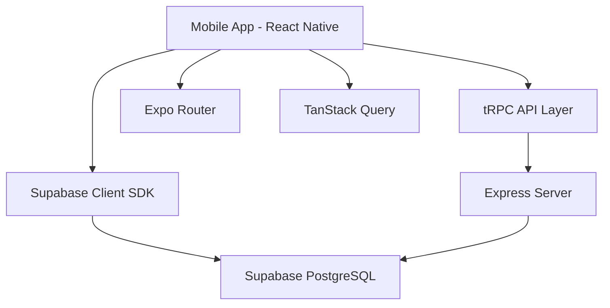
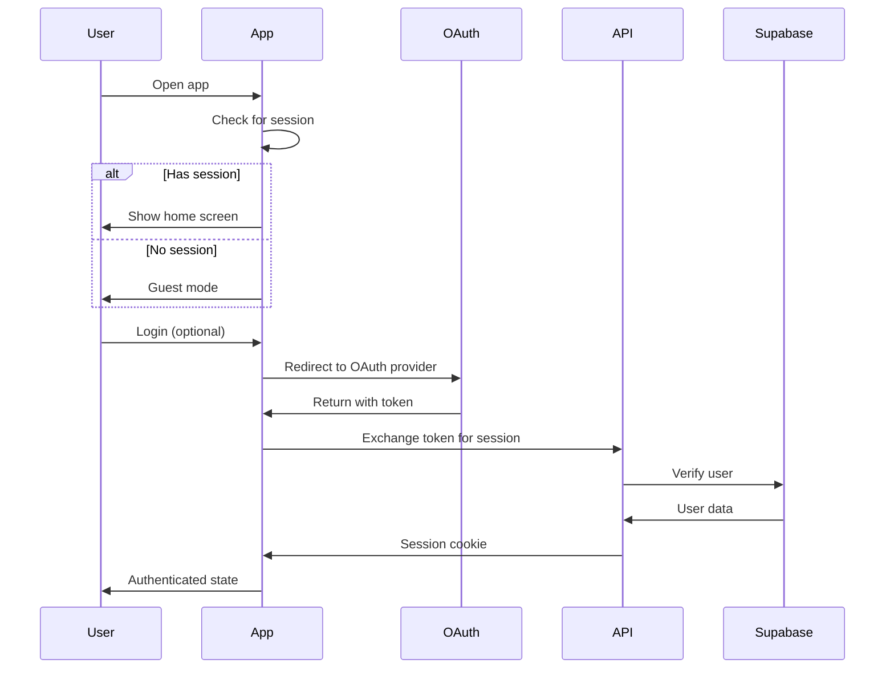

## System Architecture

Por el Barrio is built as a full-stack mobile application using modern React Native and serverless technologies.



## Technology Stack

### Frontend

<CardGroup cols={2}>
  <Card title="React Native" icon="react">
    Cross-platform mobile framework
    - Version: 0.81.5
    - New Architecture enabled
  </Card>
  <Card title="Expo" icon="e">
    Development platform and tooling
    - Version: ~54.0
    - File-based routing with Expo Router
  </Card>
  <Card title="NativeWind" icon="wind">
    Tailwind CSS for React Native
    - Version: 4.2.1
    - Utility-first styling
  </Card>
  <Card title="TypeScript" icon="code">
    Type-safe JavaScript
    - Version: 5.9.3
    - Strict mode enabled
  </Card>
</CardGroup>

### Backend

<CardGroup cols={2}>
  <Card title="tRPC" icon="plug">
    Type-safe API layer
    - Version: 11.7.2
    - End-to-end type safety
  </Card>
  <Card title="Express.js" icon="server">
    Node.js web framework
    - REST endpoints
    - Middleware support
  </Card>
  <Card title="Supabase" icon="database">
    Backend-as-a-Service
    - PostgreSQL database
    - Authentication
    - Storage
  </Card>
  <Card title="Drizzle ORM" icon="layer-group">
    TypeScript ORM
    - Version: 0.44.7
    - Type-safe queries
  </Card>
</CardGroup>

### State Management

<CardGroup cols={2}>
  <Card title="TanStack Query" icon="arrows-rotate">
    Server state management
    - Data caching
    - Background refetching
  </Card>
  <Card title="React Context" icon="circle-nodes">
    Client state management
    - Theme context
    - Header state
  </Card>
</CardGroup>

## Project Structure

```
por-el-barrio/
├── app/                    # Expo Router screens
│  ├── (drawer)/            # Drawer navigation
│  │  ├── (tabs)/          # Tab navigation
│  │  │  ├── index.tsx     # Home screen
│  │  │  ├── detalles.tsx  # Details screen
│  │  │  ├── colaboracion.tsx # Business onboarding
│  │  │  └── profile.tsx  # User profile
│  │  └── _layout.tsx
│  ├── oauth/             # OAuth callback
│  └── _layout.tsx        # Root layout
├── components/            # React components
│  ├── ui/                # UI primitives
│  └── *.tsx              # Feature components
├── hooks/                 # Custom React hooks
├── contexts/              # React contexts
├── lib/                   # Utilities
│  ├── _core/             # Core framework code
│  ├── trpc.ts            # tRPC client
│  └── supabase.ts        # Supabase client
├── server/                # Backend code
│  ├── _core/             # Core server code
│  ├── routers.ts         # tRPC routers
│  └── db.ts              # Database client
├── drizzle/               # Database schema
│  ├── schema.ts          # Table definitions
│  └── relations.ts       # Foreign keys
├── constants/             # App constants
└── shared/                # Shared types
```

## Data Flow

### Read Operations

<Steps>
  <Step title="Component Renders">
    React component calls a custom hook (e.g., `useSitiosRelevantes`).
  </Step>
  
  <Step title="Hook Fetches Data">
    Hook uses Supabase client to query the database directly.
    
    ```tsx
    const { data } = await supabase
      .from("sitios_relevantes")
      .select("*")
      .order("id");
    ```
  </Step>
  
  <Step title="Data Cached">
    TanStack Query caches the result for efficient re-use.
  </Step>
  
  <Step title="Component Updates">
    Component re-renders with the fetched data.
  </Step>
</Steps>

### Write Operations

<Steps>
  <Step title="User Action">
    User submits a form (e.g., write a review).
  </Step>
  
  <Step title="Validation">
    Client-side validation checks required fields.
  </Step>
  
  <Step title="Database Insert">
    Hook uses Supabase client to insert data.
    
    ```tsx
    await supabase.from("opiniones").insert({
      sitio_id: sitioId,
      calificacion: rating,
      comentario: comment,
    });
    ```
  </Step>
  
  <Step title="Cache Invalidation">
    TanStack Query cache is invalidated/refreshed.
  </Step>
  
  <Step title="UI Updates">
    Component shows the new data immediately.
  </Step>
</Steps>

## Authentication Flow



## Navigation Architecture

### File-Based Routing

Expo Router uses file system for navigation:

```
app/
  (drawer)/           -> Drawer navigator
    (tabs)/           -> Tab navigator
      index.tsx       -> /(drawer)/(tabs)/
      detalles.tsx    -> /(drawer)/(tabs)/detalles
    _layout.tsx       -> Drawer config
  _layout.tsx         -> Root config
```

### Navigation Flow

```tsx
// Navigate to details with params
router.push({
  pathname: "/(drawer)/(tabs)/detalles",
  params: { id: "123" }
});

// Update params without navigation
router.setParams({ categoriaId: "2" });

// Read params in screen
const { id } = useLocalSearchParams<{ id: string }>();
```

## Database Architecture

### Supabase PostgreSQL

All app data is stored in Supabase:

**Core Tables:**
- `provincia` - Provinces
- `municipio` - Municipalities
- `tipos_sitio` - Place categories
- `sitios_relevantes` - Business listings
- `user_profiles` - User profiles
- `opiniones` - Reviews
- `users` - Authentication (Drizzle)

### Direct Queries

The app queries Supabase directly from hooks:

```tsx
const { data, error } = await supabase
  .from("sitios_relevantes")
  .select("*")
  .eq("provincia_id", provinceId);
```

<Info>
  While tRPC is configured, most data operations use direct Supabase queries for simplicity.
</Info>

## Styling Architecture

### NativeWind (Tailwind)

Utility-first CSS with Tailwind classes:

```tsx
<View className="flex-1 p-4 bg-background">
  <Text className="text-lg font-bold text-foreground">
    Hello World
  </Text>
</View>
```

### Theme System

Dynamic theming with `useColors` hook:

```tsx
const colors = useColors();

<View style={{ backgroundColor: colors.surface }}>
  <Text style={{ color: colors.foreground }}>Text</Text>
</View>
```

**Theme Colors:**
- `primary` - Brand color
- `background` - Main background
- `surface` - Card backgrounds
- `foreground` - Primary text
- `muted` - Secondary text
- `border` - Borders and dividers

## Performance Optimizations

<AccordionGroup>
  <Accordion title="Memoization">
    All filters and computed values use `useMemo`:
    
    ```tsx
    const filteredPlaces = useMemo(() => {
      return places.filter(p => p.province === selectedProvince);
    }, [places, selectedProvince]);
    ```
  </Accordion>
  
  <Accordion title="Query Caching">
    TanStack Query caches API responses:
    
    ```tsx
    const queryClient = new QueryClient({
      defaultOptions: {
        queries: {
          refetchOnWindowFocus: false,
          retry: 1,
        },
      },
    });
    ```
  </Accordion>
  
  <Accordion title="Image Optimization">
    Expo Image with optimized loading:
    
    ```tsx
    <Image
      source={{ uri: imageUrl }}
      contentFit="cover"
      cachePolicy="memory-disk"
    />
    ```
  </Accordion>
  
  <Accordion title="Animated Scrolling">
    Reanimated for 60fps animations:
    
    ```tsx
    const scrollHandler = useAnimatedScrollHandler({
      onScroll: (event) => {
        scrollY.value = event.contentOffset.y;
      },
    });
    ```
  </Accordion>
</AccordionGroup>

## Security

### Row Level Security (RLS)

Supabase RLS protects data:

```sql
-- Users can read all places
CREATE POLICY "Allow public read" ON sitios_relevantes
FOR SELECT USING (true);

-- Users can insert reviews
CREATE POLICY "Allow insert reviews" ON opiniones
FOR INSERT WITH CHECK (true);
```

### Environment Variables

Sensitive data in `.env`:

```env
EXPO_PUBLIC_SUPABASE_URL=https://xxx.supabase.co
EXPO_PUBLIC_SUPABASE_KEY=xxx
```

<Warning>
  Never commit `.env` to version control. Use `.env.example` as a template.
</Warning>

## Deployment

### Frontend (Mobile)

- **iOS**: Expo EAS Build → App Store
- **Android**: Expo EAS Build → Google Play
- **Web**: Static export → Vercel/Netlify

### Backend (API)

- **Node.js server**: Deploy to Railway, Render, or Fly.io
- **Supabase**: Fully managed, no deployment needed

## Related Sections

<CardGroup cols={2}>
  <Card title="Frontend Architecture" icon="mobile" href="/architecture/frontend">
    Deep dive into React Native architecture
  </Card>
  <Card title="Backend Architecture" icon="server" href="/architecture/backend">
    API and server structure
  </Card>
  <Card title="Database Architecture" icon="database" href="/architecture/database">
    Database schema and relationships
  </Card>
</CardGroup>